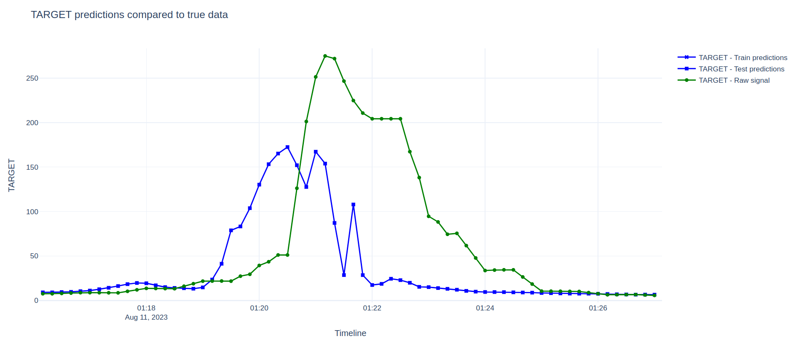
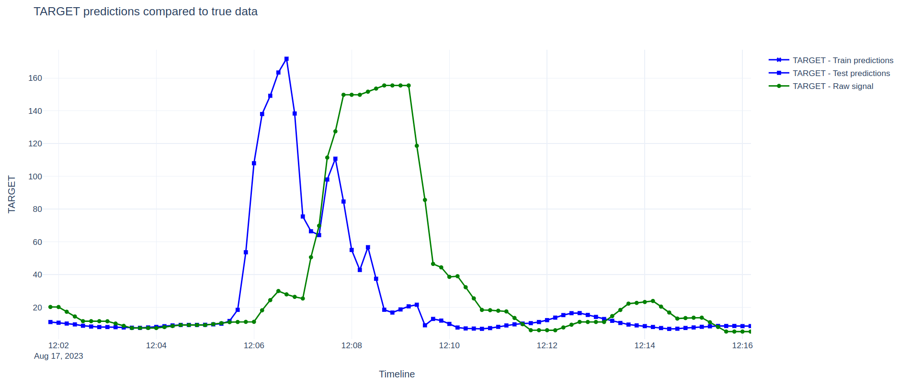
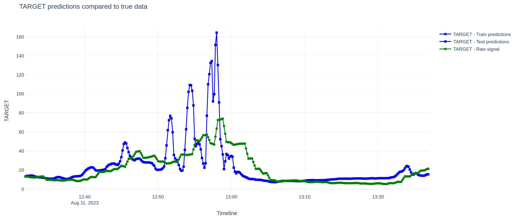

# How to understand the notebook from setting up to interpreting the results.

The foreword written at the beginning of the notebook gives a bit of context and the purpose of the whole repository. So I could suggest you to read it first and then come back here !

### Set up with Poetry

```
poetry install requirements.txt
```

### Set up without Poetry

```
pip install requirements.txt
```

### Important note

Some variables inside the notebook are used without being initialized before. This is totally normal, some cells are hidden due to confidentiality purposes.

### Interpret the results

As you know, the goal is to use LSTMs (Long short-term memory) to perform time-series forcast.

The closer your lead on the raw signal is to the quantity you assigned to `horizon`, the better !

You might notice that LSTMs, if they are ran on CPU, take a lot of time to train.
In our example we trained on less than 30h of data and we try to predict over 2 weeks of data.

Let's see the results :



For this peak, we were ahead by 1 min 30 s which is very close from `horizon` which was equal to 2 min in our case. The LSTM seems to have catch the pattern pretty well. You can witness it there as well



Of course there were some times where the model predicted a peak where the actual signal was increasing but not enough to be considered as a peak and therefore it might have been a waste of ($NaOH$).



### Conclusion

Now it's up to you !

Since the notebook is generic you can apply this architecture to your project and adjust your network and all the parameters to your own use case.
